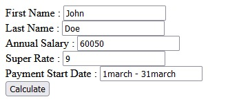
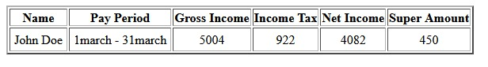

# moneyloji

Steps to run the script.
1. Clone the git repo inside htdocs/www directory and serve it directly through localhost.

Assumptions:
1. No validations are added.
2. The calulations are done for a month of data only, if needed I can setup an date field so that we can always fetch excat number of months user has put in the field.
3. The super rate should be entered without the % sign.
4. The script will return the result irrespective of the firt name, last name, payment period.
5. The only parameters which are reuired are Annual salary, super rate (should be numbers)~

Input :

Output :

